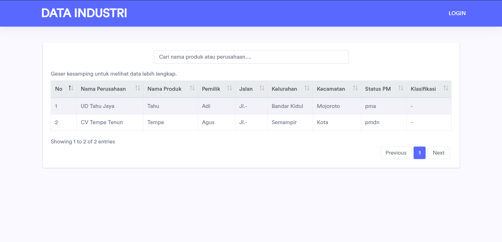
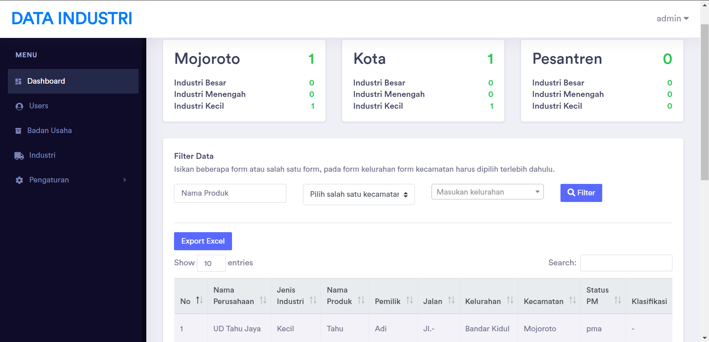
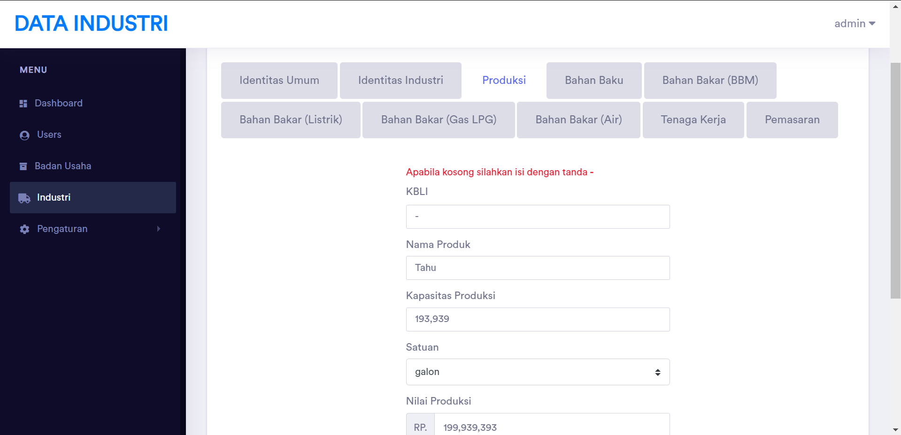

## Usage Application
> To manage all data of small, medium, and large industries in the city of Kediri

## How to run project
1. composer install
2. php artisan serve

## Screenshots

  
  
  

## Application Features
- Login
- Filter data based on districts and village
- Manage industry data
- Export excel industry data

## Framework & Libraries
- Laravel 7.0
- Yajra Datatable
- Jquery
- Maatwebsite Excel
- Bootstrap
- Select2